# 👼Angel Kitchen
## **취약 계층을 위한 무료 급식소 안내 서비스 Angel Kitchen**    

# 👼🏻About Angel Kitchen
Angel Kitchen은 취약 계층을 위해 무료 급식소를 안내해주는 앱입니다.   

# 😇Preview
# 앱 설명  
### 사용자에게 Angel Kitchen이 어떤 앱인지 간략하게 소개합니다.    
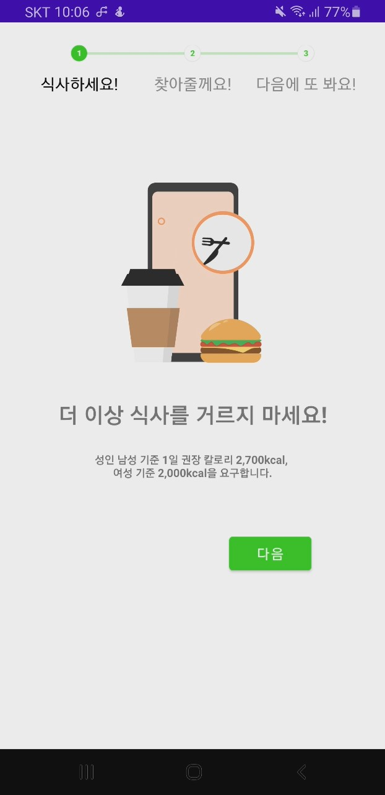
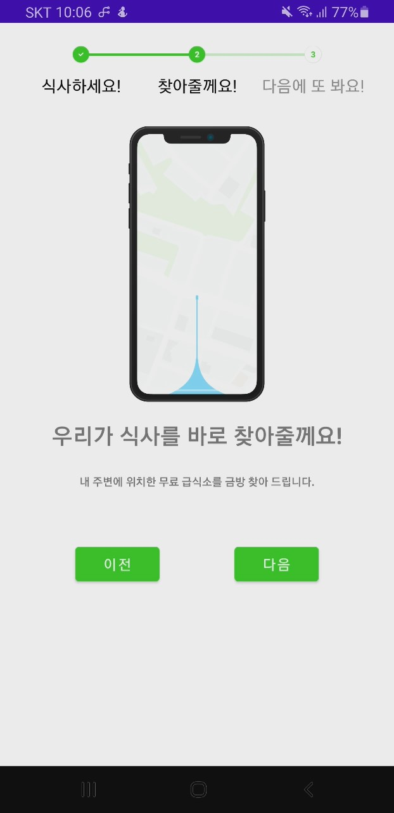
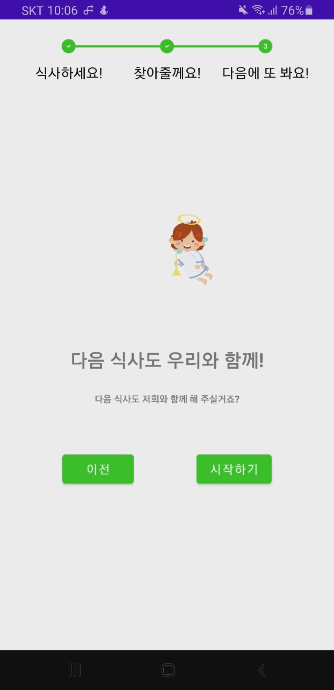  

# 내 주변 무료 급식소 찾기
### 메인 화면에서 3km 반경으로 사용자에게 무료 급식소 위치를 알려줍니다    
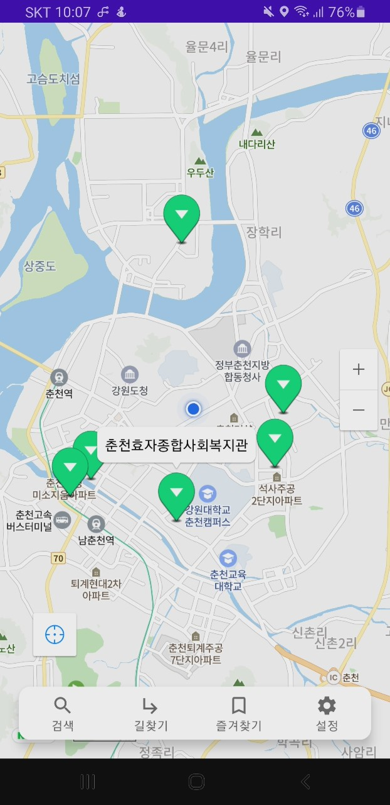  

# 무료 급식소 검색
### 검색을 통해 무료 급식소를 찾을 수 있습니다.    
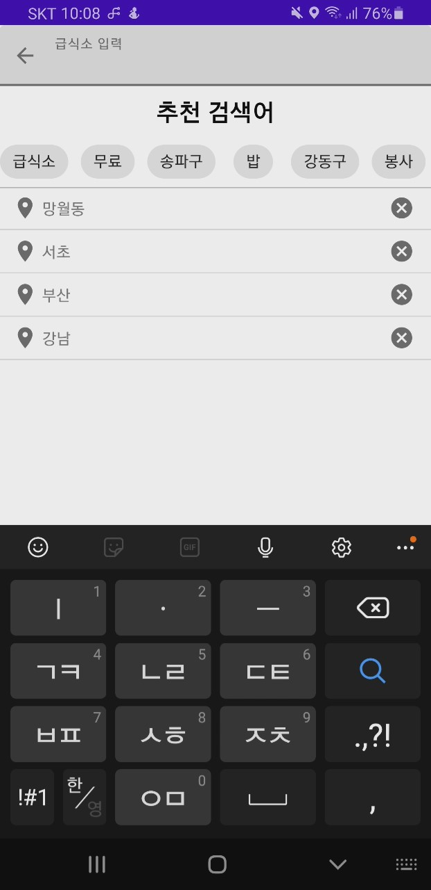 
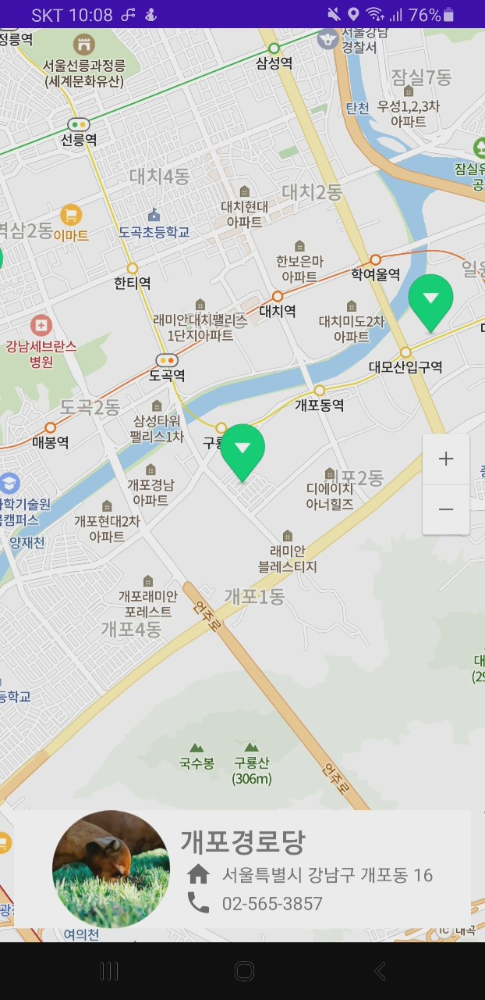 

# 무료 급식소 상세 정보
### 사용자가 선택한 무료 급식소의 위치 및 운영일자 등 자세한 정보를 볼 수 있습니다.    
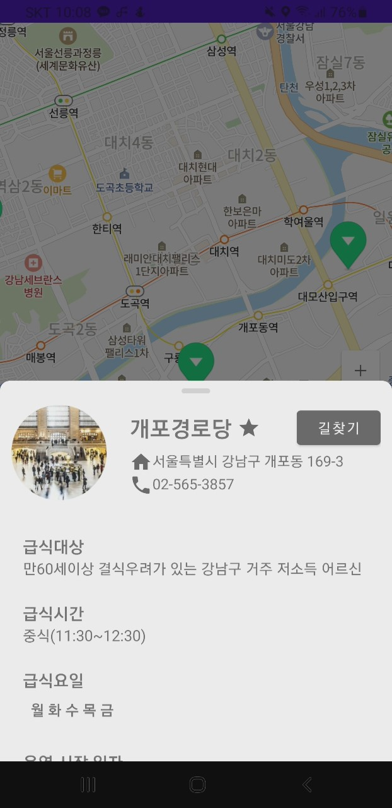 
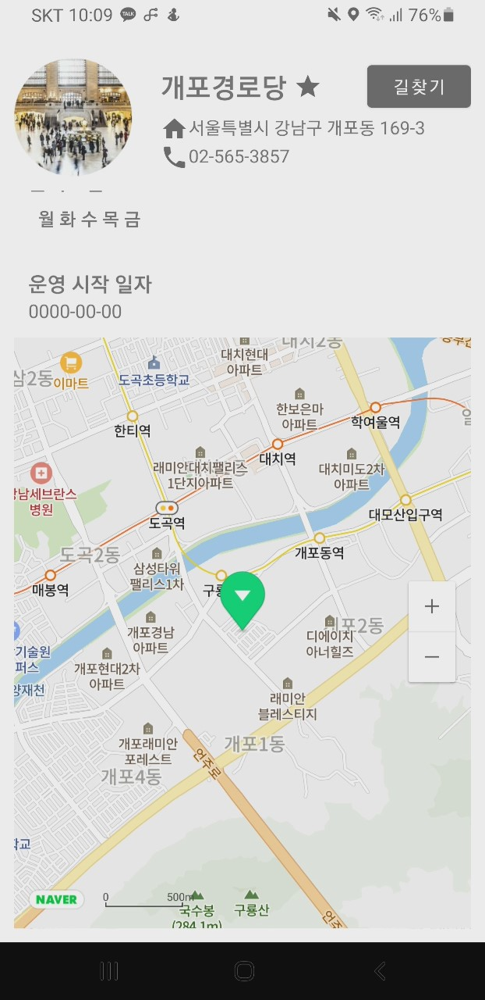

# 즐겨찾기
### 사용자가 원하는 무료 급식소를 즐겨찾기를 통해 더욱 효과적으로 관리할 수 있습니다.    
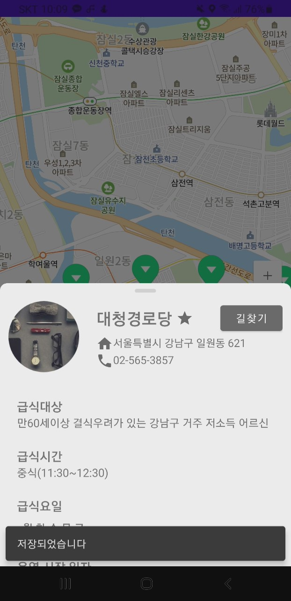 
 

# 무료 급식소 경로 안내
### 사용자 위치로부터 무료 급식소 위치까지 경로 안내를 시작합니다.    
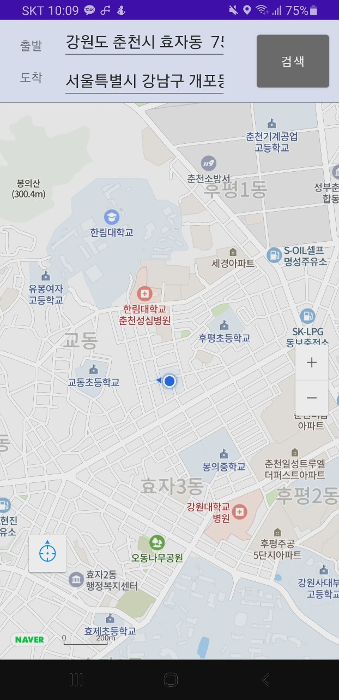 
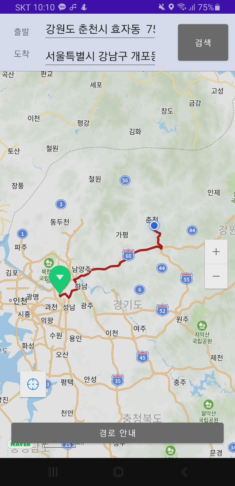 
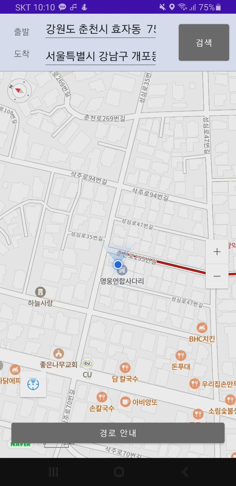 

# 📚 Specification

<table class="tg">
<tbody>
  <tr>
    <td><b>Architecture</b></td>
    <td>MVVM</td>
  </tr>
<tr>
    <td><b>Design Pattern</b></td>
<td>Repository Pattern, Delegation Pattern</td>
</tr>
<tr>
    <td><b>Jetpack Components</b></td>
<td>DataBinding, ViewBinding, LiveData, ViewModel, Lifecycle, Navigation, Room</td>
</tr>
<tr>
    <td><b>Dependency Injection</b></td>
<td>Hilt</td>
</tr>
<tr>
    <td><b>Network</b></td>
<td>OkHttp3, Retrofit2</td>
</tr>
<tr>
    <td><b>Asynchronous Processing</b></td>
<td>Coroutine</td>
</tr>
<tr>
    <td><b>Third Party Library</b></td>
    <td>Glide, Timber, Android-Stepper, TedPermission, Lottie, Coil, BottomDrawer, License Dialog, CarouselRecyclerView</td>

</tr>
<tr>
    <td><b>API</b></td>
<td>Naver Map API, Direction 5 API, Geocoding, Reverse Geocoding API</td>
</tr>
<tr>
    <td><b>Other Tool</b></td>
<td>Jira</td>
</tr>
</tbody>
</table>

 

## License
This project is licensed under the Apache 2.0 License - see the [Angel-Kitchen_Server/LICENSE](LICENSE)
